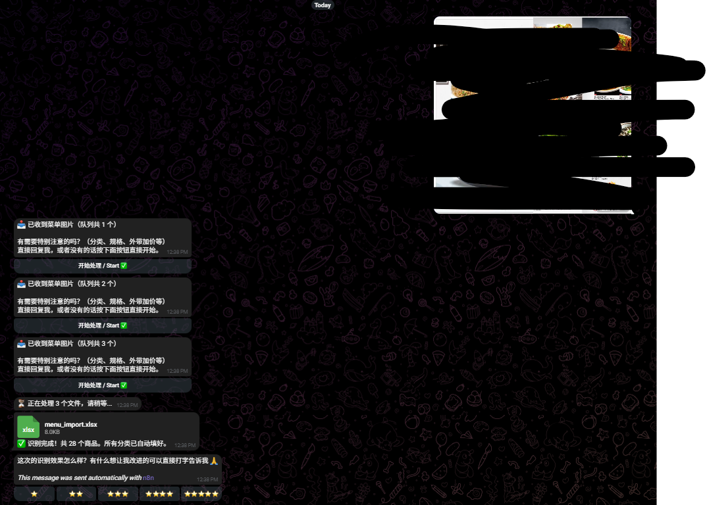

# 明录 (Ming Records) — AI-Powered Menu Digitization & POS Import Automation

> Self-initiated automation system built during an IT internship, now being incubated as a
> commercial product for F&B and traditional small businesses in Malaysia.
<p align="center">
  
</p>
## Problem

Small F&B business owners manage their menus in whatever format is convenient at the time —
a photo, a PDF, a WhatsApp text message — but importing that into a POS system means manually
re-typing every item, price, and category into a spreadsheet. This is slow, error-prone, and a
recurring pain point for non-technical business owners.

**明录** turns that into a conversation: a business owner sends a menu (photo / PDF / text) to a
Telegram bot, and receives back a POS-ready Excel file, with an AI layer handling parsing,
categorization, and formatting.

## Tech Stack

| Layer | Technology |
|---|---|
| Orchestration | n8n (self-hosted, Docker) |
| AI parsing | Google Gemini API (`gemini-flash-latest`) |
| File generation | ExcelJS (cell-level writes, custom POS-import schema) |
| Interface | Telegram Bot API (polling via Schedule Trigger) |
| Runtime | Docker container on local hardware, migrating to Hetzner Cloud |

## Architecture

The system went through a full redesign after a production incident (see *Key Engineering
Decisions* below). The current architecture splits responsibility across two decoupled n8n
workflows, connected by a fire-and-forget call:

```
┌─────────────────────────────┐         ┌──────────────────────────────┐
│   Workflow A — Receptionist  │  fire   │   Workflow B — Worker         │
│   (polls every 10s)          │ ------> │   (invoked async, no wait)    │
│                               │ forget  │                               │
│  Schedule Trigger             │         │  When Executed by Another WF  │
│   → Read Offset               │         │   → Gemini parsing            │
│   → Telegram Get Updates      │         │   → ExcelJS generation        │
│   → Main Router (queue logic) │         │   → Send result to user       │
│   → Execute Sub-Workflow      │         │                               │
│     (Wait For Completion:OFF) │         │                               │
└─────────────────────────────┘         └──────────────────────────────┘
```

- **Workflow A** never waits on the AI call. It only tracks message offsets, manages a
  per-`chat_id` queue, and replies with an inline "Start" button once a user's menu is queued.
  It always completes in tens of milliseconds.
- **Workflow B** is dispatched with *Wait For Sub-Workflow Completion* turned off, so Gemini's
  latency (which can exceed 40 seconds) never blocks the polling loop.

## Key Engineering Decisions

**1. Structural fix over defensive patching — the core lesson of this project.**
The original single-workflow design polled Telegram every 10 seconds and called Gemini inline.
When Gemini took 40+ seconds to respond, the next poll would fire before the previous run had
written its offset back to `staticData`, causing the same messages to be picked up and processed
multiple times. Locking and debouncing inside the single workflow could not fully close this
race condition, because `$getWorkflowStaticData()` only persists after an execution fully
completes. The fix was architectural: split into two workflows so the slow AI call is fully
decoupled from the fast polling loop.

**2. Correct handling of n8n/Node.js runtime quirks.**
- `$binary.data` returns a filesystem reference, not raw bytes — resolved with
  `this.helpers.getBinaryDataBuffer()`.
- `ws.addRow()` in ExcelJS silently produced null values under this workflow's data shape —
  resolved by writing cells individually.
- Native `fetch()` is unavailable inside n8n Code nodes — resolved with
  `this.helpers.httpRequest`.

**3. Multi-user safety.** Per-`chat_id` queueing plus per-update `try/catch` blocks mean one
user's malformed input, or one failed Telegram update, cannot break processing for other
concurrent users — a requirement once the bot moved from single-user testing to real
multi-merchant use.

**4. Security incident response.** A Gemini API key was accidentally exposed during
development; it was rotated immediately and credential handling was tightened. Sensitive
actions (the actual POS import step) remain deliberately human-triggered rather than fully
autonomous, by design.

## Status

In production use, approved by employer, actively serving real menu-digitization requests.

## Roadmap

- **Merchant memory** — persist per-`chat_id` category preferences and surcharge rules in
  `staticData` so returning merchants get faster, more accurate imports.
- **Agent-style clarifying questions** — instead of failing silently on ambiguous menu entries,
  the bot will ask a targeted follow-up question before generating the final file.
- Commercial validation with a one-time-payment pricing model, starting with direct outreach to
  F&B business owners.

## About This Project

Built independently during a Diploma in IT internship (Network Security track), outside of
assigned scope, and later approved by the employer for production use. The system is now the
foundation for a commercial product currently in early customer validation.
